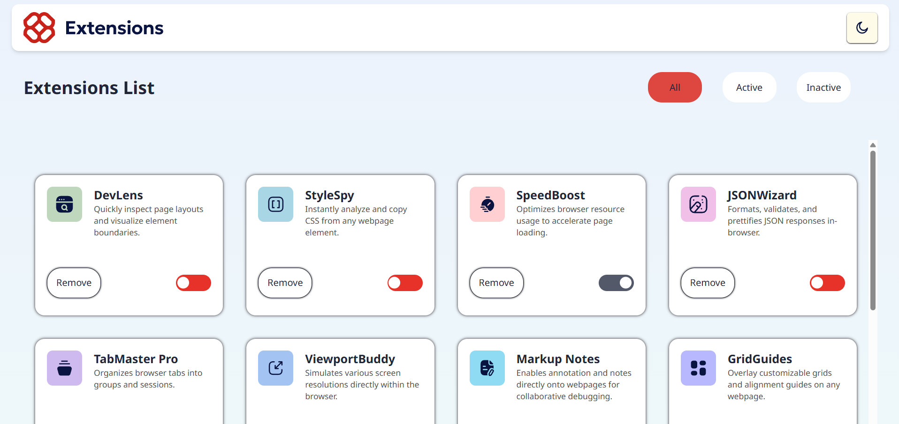
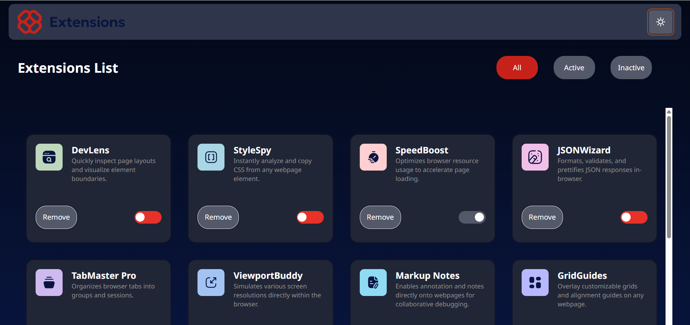
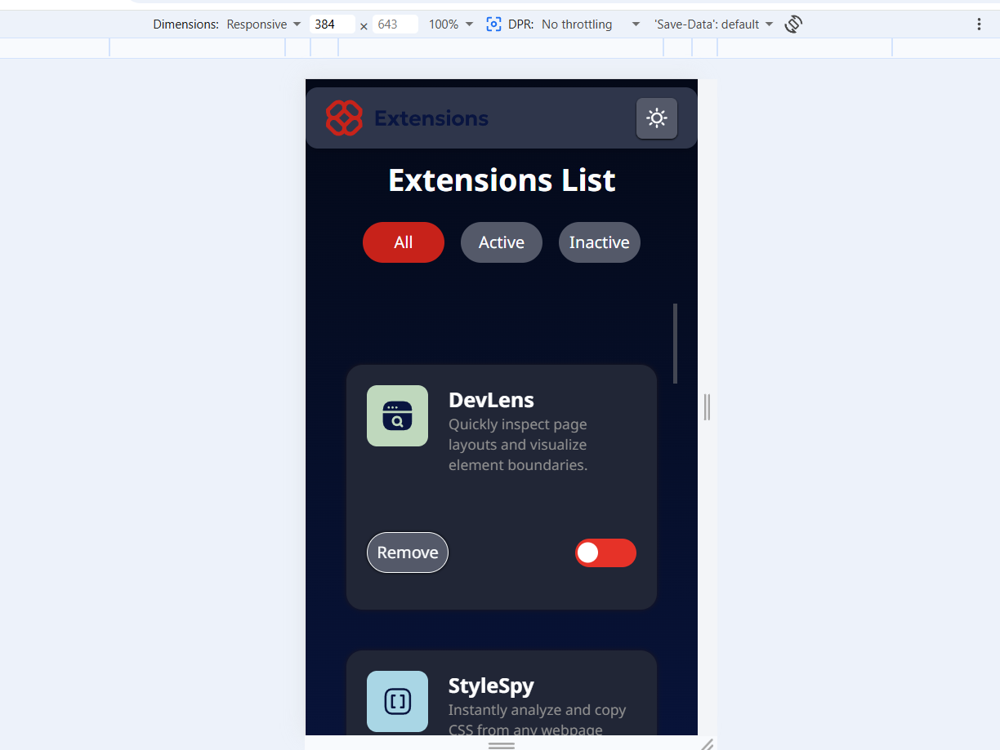

# Description
May be you have many extensions on your browser, and you want to organize them; therefore, this website is the front-end part of this project. It contains some static extensions to be testable.
(Note: the idea of this project comes from Frontend Mentor, which provides front-end challenges.)
## website screenshots.
### Light mode.

### Night mode.

### Phone preview.

# Tech stack
- Java script
- React
- tailwind Css
- gh-pages
# motivation
I usually use CSS for styling, but I noticed that it takes a lot of time to style components with CSS. Also, it is more complex to change the styling using CSS; therefore, I decided to learn Tailwind CSS, and I wanted to practice it by making a project, which is this project. Also, I learned how to use Tailwind CSS with React.
# how it works.
The first feature you can change is the mode. You can toggle the mode using the mode button in the header. This button changes the mode state, which activates the `useEffect` hook that saves the mode in local storage. The second section is the `filter`. First, it checks if there is no filter, then it renders all the data. Otherwise, if there is a filter, it renders the required data using the filter method, which checks whether the element matches the filter or not. Also, you can toggle the state of each component card to be active or inactive. In addition, you can remove the component from the screen. The local storage system saves each change that occurs in the data state, but if an object is removed, reloading the page returns it to its default settings.
# Challenges.
Since it was my first time using Tailwind CSS in a real project, I faced some problems memorizing the classes, and it took a lot of time to search for the class I wanted. Also, the filter system took a lot of time because I searched a lot about how to filter the data without changing the data state. In addition, I used AI to suggest some methods that I could use to filter the data without changing the state or updating the local storage, then I implemented them in my own way.
